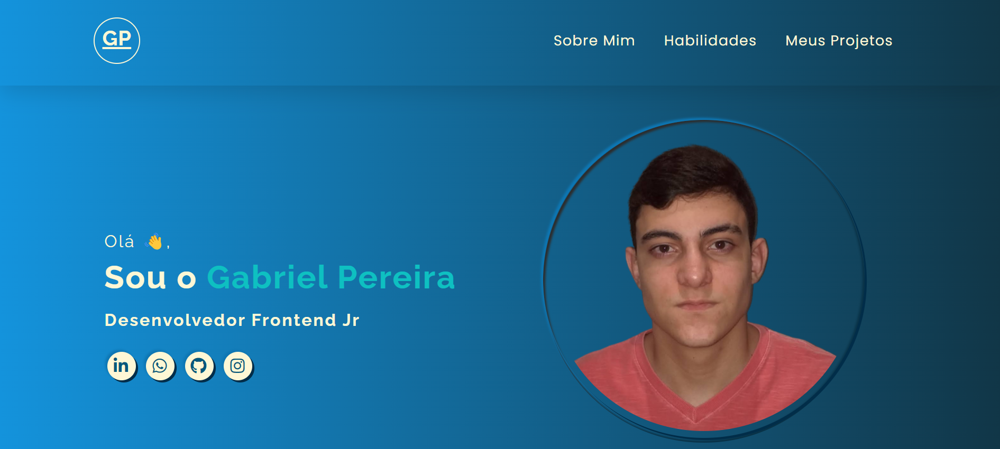

# Portifólio Pessoal

  

## Desing: 
* 

## Descrição

  

   Meu portfólio pessoal é uma coleção de projetos, experiências e habilidades que compartilho para demonstrar meu trabalho e paixão na área de desenvolvimento web. Este       portfólio foi desenvolvido utilizando HTML, CSS e JavaScript e está hospedado no 
    <a href="https://gabrielduartep.github.io/portifolio/">GitHub-Pages</a>.
  

## Funcionalidades

O portfólio inclui as seguintes funcionalidades:

- **Página Inicial**: Uma página de boas-vindas com uma breve introdução sobre mim e meu trabalho.

- **Sobre Mim**: Uma seção onde as pessoas podem conhecer um pouco mais sobre mim.

- **Habilidades**: Uma lista de habilidades e tecnologias que domino.

- **Projetos**: Uma seção que destaca os projetos em que trabalhei, apresentando imagens, títulos e descrições.

- **Formulário de Contato**: Um meio para que as pessoas possam entrar em contato comigo diretamente.

- **Design responsivo**: para se adaptar a diferentes tamanhos de tela.

## Tecnologias utilizadas:

 * HTML
 * CSS
 * JAVASCRIPT

 ### Pra entrar em contato, veja as redes abaixo!
 

 
  
  
   

